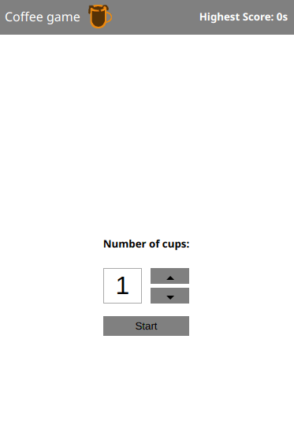

# Drunk with Coffee game

Simple game for demonstration. [Play now](https://kakiee.at/coffee-challenge/)

# Installation

- `git clone https://github.com/AhmedBHameed/coffee-test`
- `npm install` OR `yarn`
- `yarn start`

## What's included

- Bundling with parcel
- Dev server with hot module replacement
- React 16
- styled-components

## Usage

Drink as much coffee as you can without overflow it. Till you get drunk with good stuff of coffee ;)

## Build

- `npm run build` OR `yarn build` but note for the files change in dist. PWA is caching static files which may change with hash part.

## Some hurdles

- I can see the app is using `parcel` which causing error on console on `build`. I would suggest to apply the game with the newest React boiler plate since they use either `babel` or `typescript` or other task bundler which are at least better than `parcel` i believe like `rollup`.

- Since i'm new to PWA, I did a basic programming part related. Hope that it will work on your side as it worked on mine. PWA is a big topic and i believe there are many parts in the code can be handel in a better way.

- Regarding to the game itself, I would do some refactoring parts for the components. But since the test did not say about performance, i just make it work and functional.
  What i mean by performance is that the timer for example is applied for all cups which is using render for each cup component. As a feature step for the app i can move up the timer to the parent component and handel it with events when needed.

- If you see some difference in `package.json` that comes from try and error using parcel bundler to see where the problem of the error code mentioned up comes from. A point of prove about it - you can check other branch `app/webpack` as webpack applied on the application for better bundling options and structure but it is not complete.
